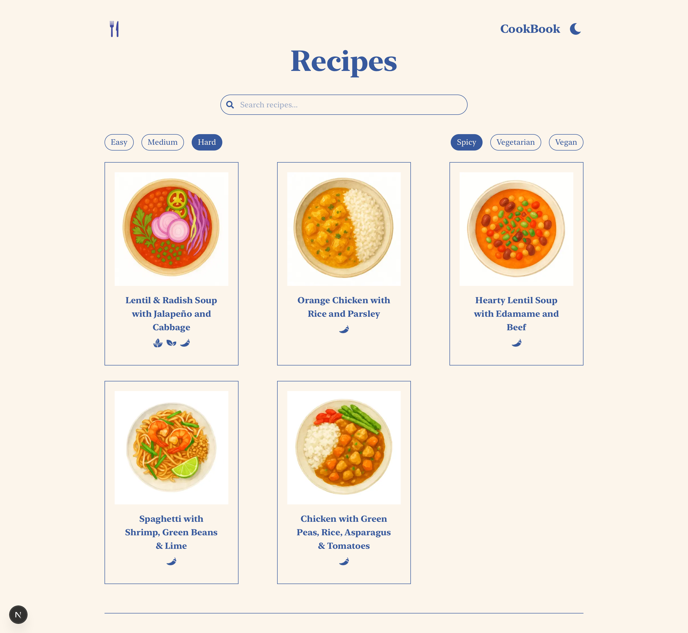
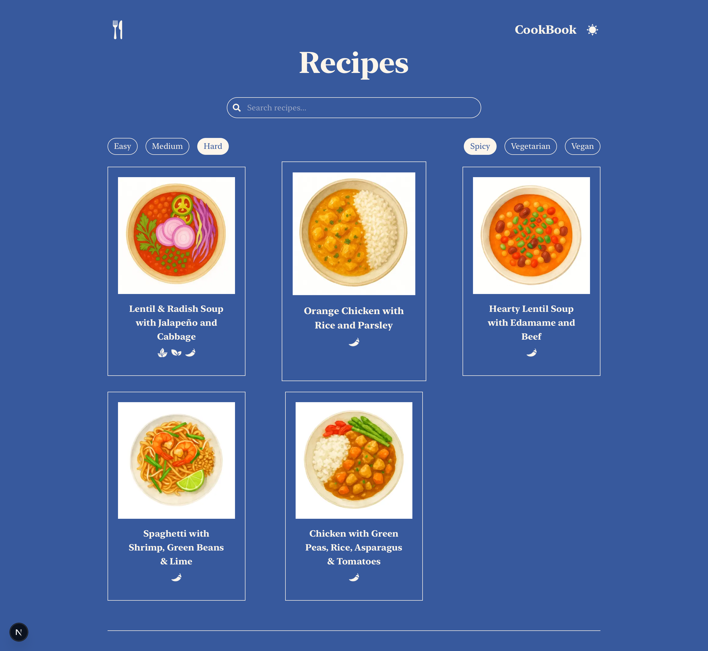
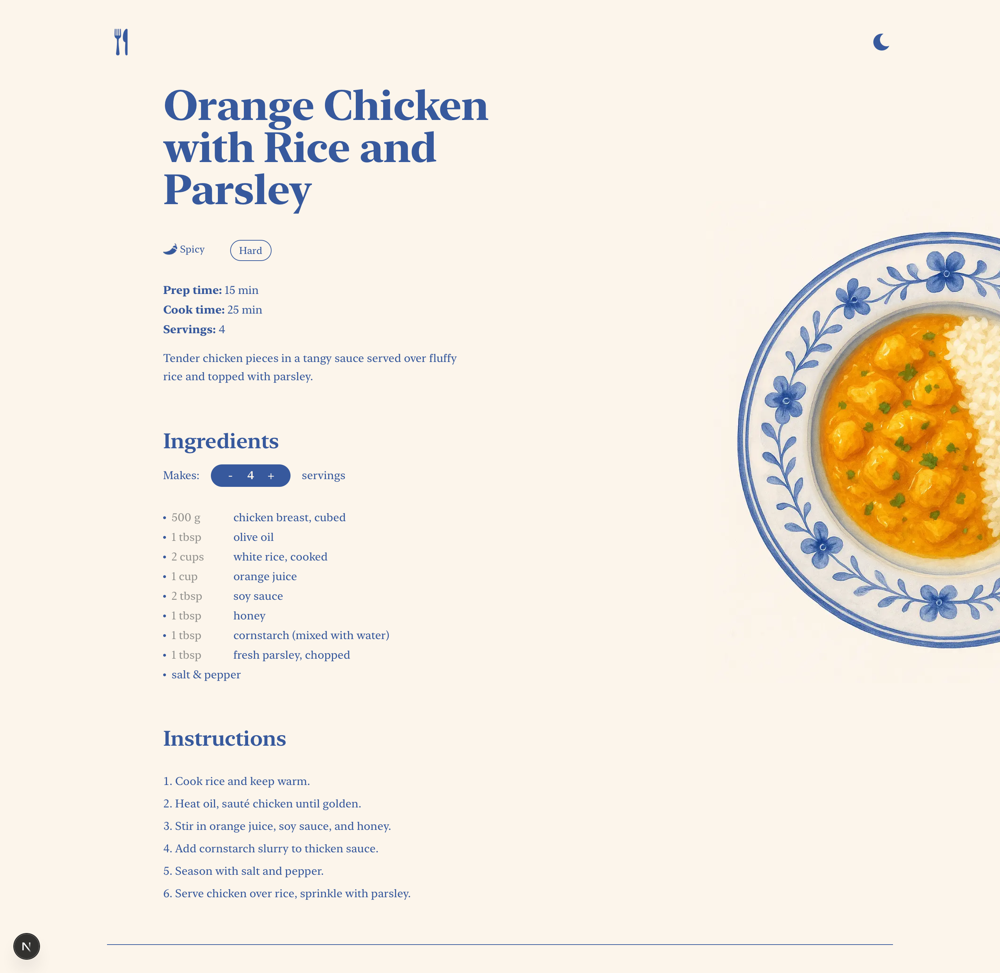
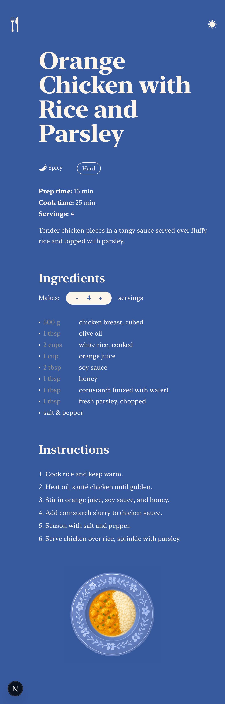
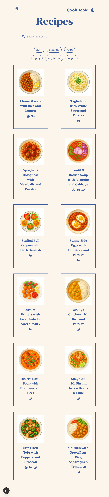

# CookBook

CookBook is a recipe web application, featuring a responsive layout. It's built with Next.js, TypeScript, Sanity CMS, and custom React + Tailwind CSS components.
It allows users to browse recipes, filter by category, search by name, view detailed recipe instructions, adjust servings, and see dietary indicators like vegan, vegetarian, or spicy. The app supports a light/dark theme powered by ThemeProvider for a dynamic visual experience.

## Features

- Browse all recipes and filter by category
- Search recipes by title or keywords
- Light/dark theme toggle for personalized experience
- View detailed recipe pages with ingredients, prep/cook time, and instructions
- Adjust servings dynamically with real-time ingredient scaling
- Stylized dish images displayed on a plate for each recipe
- Visual indicators for vegan, vegetarian, or spicy recipes

## CICD

CookBook uses a CI/CD pipeline to ensure reliable deployments:
- **Automated Testing & Build**  
Every push or pull request triggers ESLint, TypeScript type checks, unit tests, and end-to-end tests.
- **Dockerized Deployment**  
On the main branch, successful builds are automatically packaged into Docker images and pushed to DockerHub.
- **Seamless Hosting**  
The pipeline integrates with Vercel for instant deployment, ensuring the live app is always up-to-date.

## Technologies Used

- **Next.js 13+ (App Router) with React components**
- **Tailwind CSS for responsive styling**
- **Sanity CMS for content management**
- **ThemeProvider (next-themes) for light/dark mode**
- **Vercel for deployment and hosting**
- **AJAX-style data fetching for recipes**
- **Jest for unit testing**
- **Cypress for e2e testing**  
- **Docker for containerized builds**

## Testing

### Jest
- Unit tests coverage reports are generated in HTML and saved in CI artifacts for inspection.

### Cypress
- End-to-end tests simulate real user flows:
  - Browsing recipes and filtering by category
  - Searching for recipes by title or keywords
  - Viewing detailed recipe pages with ingredients, instructions, and dietary indicators
  - Adjusting servings dynamically
- Coverage of critical workflows complements unit testing.

## Skills Demonstrated

- Building responsive and interactive UI with React and Tailwind CSS
- Integrating CMS content dynamically with Sanity
- Implementing a theme toggle with next-themes
- Dynamic ingredient scaling based on servings
- Filtering and searching data in a client-side React application
- Structuring a scalable Next.js project with clean code and reusable components
- Configuring deployment on Vercel with environment variables and Sanity CORS settings
- Setting up CI/CD pipeline with GitHub Actions to automatically lint, run unit and e2e tests, collect coverage and deploy buulds to Vercel
- Writing unit tests with Jest and generating coverage reports
- Writing end-to-end tests with Cypress to simulate real user interactions
- Managing test artifacts by uploading coverage reports for monitoring code quality

## UX Principles Applied

The design of CookBook incorporates few key UX principles to create an intuitive and user-friendly experience:

- **Aesthetic-Usability Effect**  
Stylized dish images on plates, along with consistent typography and color schemes, make the app feel more aesthetically pleasing and more usable.

- **Law of Similarity**  
Dietary icons (vegan, vegetarian, spicy) share a consistent visual style, allowing users to recognize and understand them quickly.

- **Chunking**  
On the recipe list page, all recipes are displayed in uniform cards. This groups each recipe into a distinct, digestible unit, making it easier for users to scan and process multiple items at once.

- **Law of Proximity**  
Related elements (e.g., ingredient amounts and serving adjustment buttons) are grouped closely together, making it easier to understand their relationships.

## Run

Go to [https://cook-book-wiktoria.vercel.app](https://cook-book-wiktoria.vercel.app)  
No password is required.

## Preview

